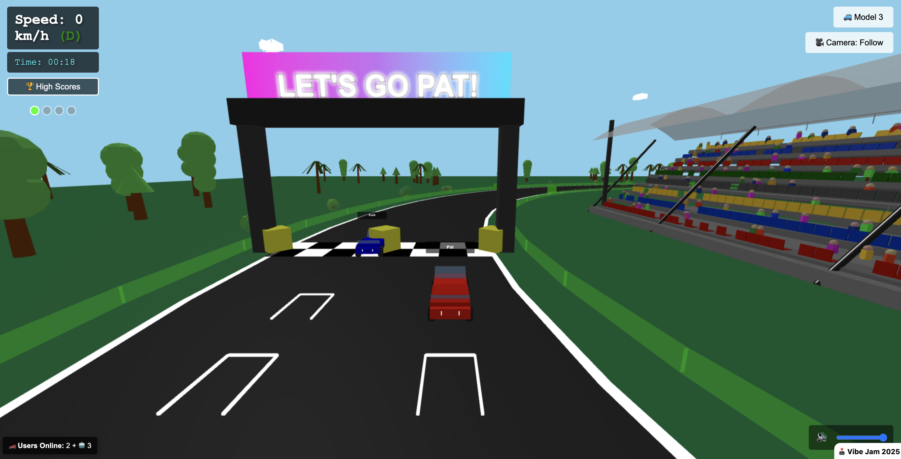

# 🏎️ Racing Cart

A 3D browser-based racing game built with Three.js, featuring multiplayer support, AI opponents, and realistic physics.

> **🎮 Vibejam Project**: This project was completely vibcoded and built during the vibejam initiated by levels.io!




## 🎮 Features

### Core Gameplay
- **3D Racing Environment** - Immersive oval track with realistic physics
- **Multiple Car Models** - Classic cars, F1 cars, and Tesla models
- **AI Opponents** - Intelligent AI cars with realistic racing behavior
- **Power-ups & Items** - Speed boosts, shells, and bananas for strategic gameplay
- **High Score System** - Track your best lap times and compete globally

### Multiplayer
- **Public Rooms** - Join instant multiplayer games
- **Private Rooms** - Create private rooms to play with friends
- **WebRTC P2P** - Direct peer-to-peer connections for low latency
- **Real-time Racing** - Synchronized multiplayer racing experience

### Technical Features
- **Responsive Design** - Works on desktop and mobile devices
- **Touch Controls** - Mobile-friendly touch controls
- **Audio System** - Immersive sound effects and music
- **Performance Optimized** - Smooth 60fps gameplay

## 🚀 Quick Start

### Prerequisites
- Node.js 16+ 
- npm or yarn

### Installation

1. **Clone the repository**
   ```bash
   git clone https://github.com/pc6n/vibecart.git
   cd vibecart
   ```

2. **Install dependencies**
   ```bash
   npm install
   cd server && npm install
   ```

3. **Configure environment**
   ```bash
   cp .env.example .env
   # Edit .env with your configuration
   ```

4. **Start the development servers**
   ```bash
   # Terminal 1: Start the game server
   cd server
   npm run dev
   
   # Terminal 2: Start the client
   cd ..
   npm run dev
   ```

5. **Open your browser**
   ```
   http://localhost:8080
   ```

## 🎯 Game Modes

### 🏁 Single Player
- Race against AI opponents
- Practice your skills
- Beat your best lap times

### 👥 Multiplayer
- **Public Rooms**: Join instant games with other players
- **Private Rooms**: Create rooms and invite friends
- **Real-time Racing**: Synchronized multiplayer experience

## 🎮 Controls

### Desktop
- **Arrow Keys** or **WASD** - Steering and acceleration
- **Space** - Brake
- **Shift** - Use power-up
- **R** - Reset car position

### Mobile
- **Touch Controls** - On-screen steering wheel and buttons
- **Tilt Controls** - Use device orientation for steering

## 🛠️ Development

### Project Structure
```
racingcart/
├── src/                    # Client-side code
│   ├── js/
│   │   ├── game.js        # Main game logic
│   │   ├── car.js         # Car physics and controls
│   │   ├── track.js       # Track management
│   │   ├── multiplayer/   # Multiplayer components
│   │   └── ui/           # User interface
├── server/                # Server-side code
│   ├── src/              # Server source
│   └── dist/             # Compiled server
├── public/               # Static assets
└── scripts/              # Build and utility scripts
```

### Available Scripts

```bash
# Development
npm run dev              # Start client development server
npm run build            # Build for production
npm run preview          # Preview production build

# Server
cd server
npm run dev              # Start server in development mode
npm run build            # Build server
npm start                # Start production server
```

### Environment Variables

Create a `.env` file based on `.env.example`:

```env
# Server Configuration
SERVER_URL=http://localhost:1337
DOMAIN_NAME=localhost

# Client Secret for Score Validation
CLIENT_SECRET=your_client_secret_here

# TURN Server Configuration (for WebRTC)
TURN_SERVER_URL=turn:your-turn-server.com:3478
TURN_USERNAME=your_turn_username
TURN_CREDENTIAL=your_turn_password
```

## 🏗️ Architecture

### Client-Side
- **Three.js** - 3D rendering and scene management
- **WebRTC** - Peer-to-peer multiplayer communication
- **Socket.IO** - Real-time server communication
- **Vite** - Build tool and development server

### Server-Side
- **Node.js** - Server runtime
- **Express** - Web framework
- **Socket.IO** - WebSocket communication
- **WebRTC Signaling** - Peer connection coordination

## 🤝 Contributing

We welcome contributions! Please see our [Contributing Guidelines](CONTRIBUTING.md) for details.

### Development Setup
1. Fork the repository
2. Create a feature branch
3. Make your changes
4. Test thoroughly
5. Submit a pull request

## 📄 License

This project is licensed under the MIT License - see the [LICENSE](LICENSE) file for details.

## 👥 Contributors

- **Patrick Christen** - Project Creator & Lead Developer

## 🙏 Acknowledgments

- **Three.js** - 3D graphics library
- **Socket.IO** - Real-time communication
- **WebRTC** - Peer-to-peer connections
- **Vite** - Build tooling

## 🐛 Issues & Support

- **Bug Reports**: [GitHub Issues](https://github.com/pc6n/vibecart/issues)
- **Feature Requests**: [GitHub Discussions](https://github.com/pc6n/vibecart/discussions)
- **Documentation**: [Wiki](https://github.com/pc6n/vibecart/wiki)

---

**Happy Racing! 🏁**
